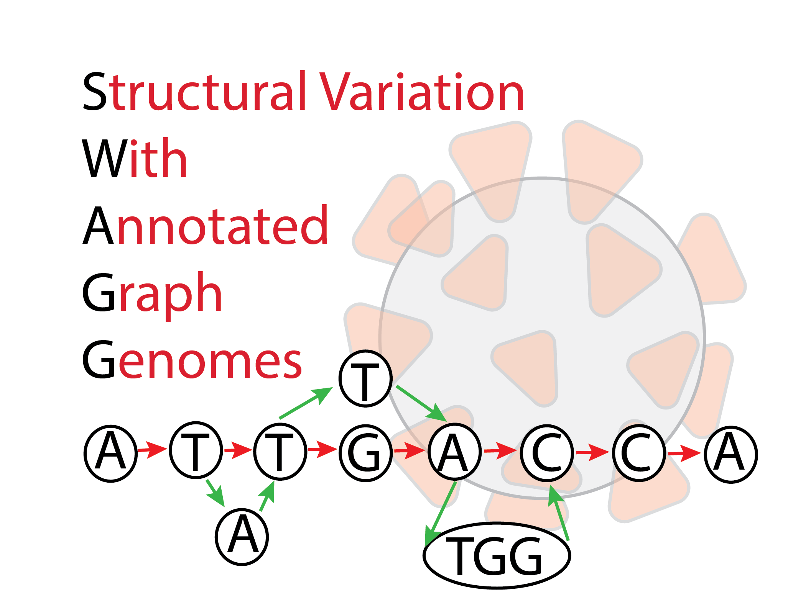

# swagg


SWAGG is a pipeline to make graph genomes from read data. The input into the pipeline are reads with/without reference genome(s). Reads can be short-reads or preprocessed (basecalled) long-reads. Reads are assembled into longer contigs, and contigs are mapped back to the reference genome to look for discrepancies with the reference genome. These discrepancies can be either real mutations or sequencing artifacts, and are found using structural variant tools which output VCF files for each read set. These VCF files are taken together to make the genome graph at the end of the pipeline.

## Pipeline Overview


### To do at end of hackathon: Make a free DOI with zenodo: <https://guides.github.com/activities/citable-code>

## Website (if applicable)

## Intro statement

## What's the problem?

## Why should we solve it?

# What is <this software>?

Overview Diagram

# How to use <this software>

# Software Workflow Diagram

# File structure diagram 
#### _Define paths, variable names, etc_

# Installation options:

We provide two options for installing <this software>: Docker or directly from Github.

### Docker

The Docker image contains <this software> as well as a webserver and FTP server in case you want to deploy the FTP server. It does also contain a web server for testing the <this software> main website (but should only be used for debug purposes).

1. `docker pull ncbihackathons/<this software>` command to pull the image from the DockerHub
2. `docker run ncbihackathons/<this software>` Run the docker image from the master shell script
3. Edit the configuration files as below

### Installing <this software> from Github

1. `git clone https://github.com/NCBI-Hackathons/<this software>.git`
2. Edit the configuration files as below
3. `sh server/<this software>.sh` to test
4. Add cron job as required (to execute <this software>.sh script)

### Configuration

```Examples here```

# Testing

We tested four different tools with <this software>. They can be found in [server/tools/](server/tools/) . 

# Additional Functionality

### DockerFile

<this software> comes with a Dockerfile which can be used to build the Docker image.

  1. `git clone https://github.com/NCBI-Hackathons/<this software>.git`
  2. `cd server`
  3. `docker build --rm -t <this software>/<this software> .`
  4. `docker run -t -i <this software>/<this software>`
  
### Website

There is also a Docker image for hosting the main website. This should only be used for debug purposes.

  1. `git clone https://github.com/NCBI-Hackathons/<this software>.git`
  2. `cd Website`
  3. `docker build --rm -t <this software>/website .`
  4. `docker run -t -i <this software>/website`
  
# Read Simulators:

Nanopore simulator: <https://github.com/bcgsc/NanoSim/blob/master/README.md>

PacBIo simulator: <http://cgm.sjtu.edu.cn/PaSS>

Illumina simulator: <https://www.niehs.nih.gov/research/resources/software/biostatistics/art/index.cfm>
